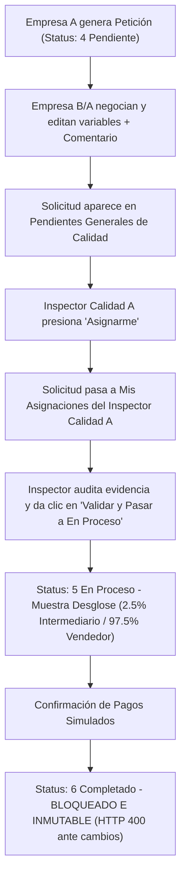

# 🌿 ECOBOROS - Arquitectura, Flujo de Negocio y Roles del Sistema

Este documento describe detalladamente la lógica operativa, el flujo de ventas, los roles de usuario y las reglas de negocio implementadas en la plataforma **ECOBOROS**. Está diseñado para mantener a todo el equipo de desarrollo alineado con el funcionamiento actual del sistema.

---

## 📌 Visión General del Sistema

**ECOBOROS** es una plataforma B2B para la comercialización, trazabilidad y valorización de residuos industriales. Conecta a empresas generadoras (vendedoras) con empresas procesadoras/recicladoras (compradoras), incorporando un esquema de arbitraje por **Inspectores de Control de Calidad** y un modelo financiero sostenible basado en comisiones por transacción.

---

## 👥 Roles del Sistema y sus Responsabilidades

### 1. 🏢 Empresa Vendedora (Empresa B / Publicadora)
* **Publicación de Residuos**: Registra publicaciones de residuos industriales indicando categoría, peso disponible, precio unitario y ubicación.
* **Negociación Fuera de Plataforma**: Contacta directamente a la Empresa Compradora para acordar la compraventa (cantidades parciales, contra-ofertas de precio o condiciones de entrega).
* **Edición en Estado `Pendiente`**:
  * Puede editar los **campos variables**: `cantidad`, `requested_weight` (peso en kg) y `offered_price` (precio unitario).
  * Registra un **Comentario de Negociación** obligatorio/explicativo (ej. *"Se acordó en llamada vender únicamente 25k kg de los 50k kg disponibles para mantener inventario en planta"*).
  * **Regla clave**: El ajuste realizado por la empresa **mantiene la solicitud en estatus `Pendiente`** y no se aprueba automáticamente; requiere obligatoriamente la auditoría de un Inspector de Calidad.

### 2. 🏬 Empresa Compradora (Empresa A)
* **Exploración de Catálogo**: Examina las publicaciones activas y genera **Peticiones de Compra** (`purchase_requests`) especificando el peso o volumen deseado.
* **Participación en la Negociación**: Puede proponer precios u ofertas en comunicación directa con la Empresa Vendedora.
* **Seguimiento y Pago Simulado**: Visualiza el desglose financiero de la operación en estatus `En Proceso` y simula la confirmación de pagos.

### 3. 🔍 Inspector de Control de Calidad (Rol Calidad)
Los usuarios de Calidad actúan como **auditores independientes** y garantizan la veracidad de los materiales entregados y los pagos acordados. Existen múltiples inspectores de calidad en el sistema (ej. *Calidad A*, *Calidad B*, *Calidad C*).

#### Sub-Flujo de Asignación y Auditoría por Calidad:
1. **📥 Tab "Pendientes Generales (Sin Asignar)"**:
   * Todos los inspectores de calidad pueden ver las nuevas solicitudes creadas por las empresas.
   * Cualquier inspector puede presionar **"📌 Asignarme para Seguimiento"**. Al hacerlo, se vincula permanentemente `quality_validator_id` con su ID de usuario.
2. **📋 Tab "Mis Asignaciones (En Seguimiento)"**:
   * La solicitud pasa de manera exclusiva a la bandeja personal del inspector asignado.
   * **Garantía de Seguridad**: Evita interferencias entre inspectores. Únicamente el inspector asignado (quien asistió a la planta o verificó la evidencia en su dispositivo móvil) puede dictaminar y aprobar la solicitud.
3. **Auditoría y Dictamen**:
   * El inspector revisa el **Comentario de Negociación** dejado por las empresas y los campos variables.
   * Al confirmar la veracidad, presiona **"✅ Validar Dictamen y Pasar a EN PROCESO"** (`status_id = 5`).
4. **Cierre de Operación**:
   * En `En Proceso`, supervisa la confirmación de pagos y transiciona la operación a `Completado` (`status_id = 6`).

### 4. 🛡️ Administrador
* Posee **trazabilidad completa**: En todo momento el sistema registra qué inspector de calidad auditó, aprobó o rechazó cada publicación o solicitud de compra (`quality_validator_id`), asegurando deslinde de responsabilidades.

---

## 🔄 Flujo de Vida de una Transacción (`purchase_requests`)



### Tabla de Estados de la Solicitud

| Status ID | Nombre Estado | Descripción y Reglas de Negocio |
| :---: | :--- | :--- |
| **4** | **Pendiente** | Creada por Empresa A. Se permite la edición de campos variables (`cantidad`, `peso`, `precio`) y comentarios por parte de las empresas. Disponible para asignación de un Inspector de Calidad. |
| **5** | **En Proceso** | Auditada y validada por el Inspector de Calidad asignado. Muestra el desglose financiero del **2.5% de comisión** y el **97.5% de ganancia para la Empresa B**. Habilita confirmaciones de pago. |
| **6** | **Completado** | Operación finalizada con éxito. **Totalmente Inmutable**: El backend rechaza cualquier intento de actualización con un error `HTTP 400 Bad Request`. |
| **3** | **Rechazado** | Desestimada por Calidad o cancelada por inconformidad en el dictamen. |

---

## 💰 Desglose Financiero y Modelo de Negocio

Cuando una solicitud pasa a estado **En Proceso** (`status_id = 5`), el sistema calcula automáticamente:

1. **Monto Total de la Operación**: `peso_solicitado * precio_ofrecido`
2. **Comisión del Software Intermediario (2.5%)**: `monto_total * 0.025`
   * *Propósito*: Destinado al mantenimiento técnico de la plataforma y el pago de salarios del personal de Control de Calidad.
3. **Pago Neto para Empresa B Vendedora (97.5%)**: `monto_total * 0.975`

---

## 🧪 Verificación Automatizada en Consola

Para verificar que toda la lógica de negocio, asignación de inspectores, comentarios y reglas de inmutabilidad funcionan sin fallas:

```bash
# Ejecutar script de pruebas automatizadas contra la API REST (Docker)
python Scripts/test_purchase_workflow.py
```

### Cobertura del Script de Pruebas:
1. Creación de solicitud en `Pendiente` por Empresa A.
2. Contra-oferta y edición de campos variables con registro de `negotiation_comment` por Empresa B.
3. Asignación exclusiva de la solicitud a una Inspectora de Calidad en `Pendiente`.
4. Auditado de dictamen y avance a `En Proceso`, verificando matemáticamente la comisión del 2.5% y el 97.5%.
5. Confirmación de pagos simulados y transición a `Completado`.
6. Verificación del rechazo inmutable `HTTP 400` al intentar modificar un registro `Completado`.
